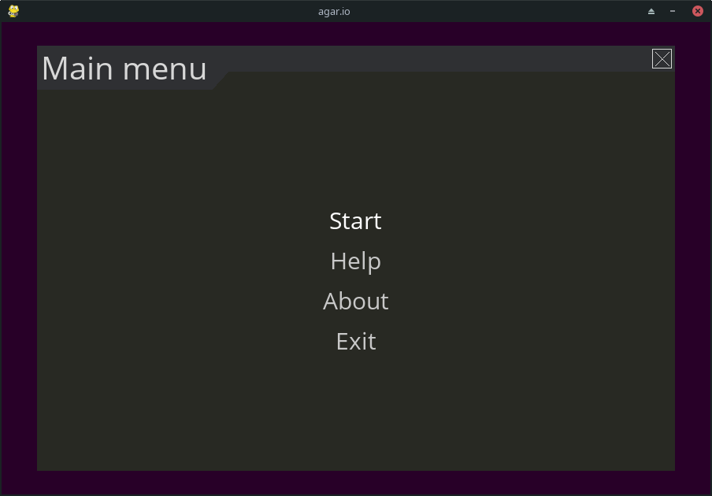
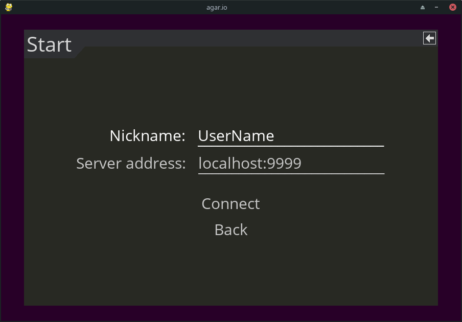
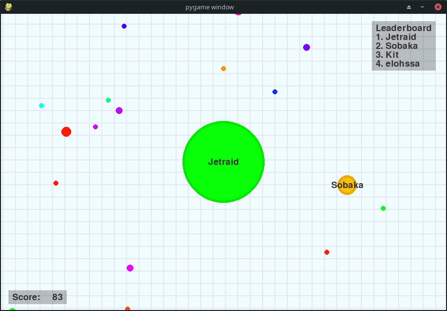

# agar.io
This is multiplayer python implementation of game [agar.io](https://en.wikipedia.org/wiki/Agar.io).

## Stack
- Python3
- [PyGame](https://www.pygame.org/)
- [pygame-menu](https://github.com/ppizarror/pygame-menu)
- [socket](https://docs.python.org/3/library/socket.html)
- [loguru](https://github.com/Delgan/loguru)

## Features
- [x] Full game loop
- [x] HUD with score and top players
- [x] Splitting by "Space" key
- [x] Shooting by "W" key
- [x] Players receive information only about the nearest chunks
- [x] Communication between the client and the server occurs via sockets

## Setup
Clone the repository and change the working directory:

    git clone https://github.com/alexandr-gnrk/agario.git
    cd agario
Create and activate the virtual environment:

    python3 -m venv ./venv
    source ./venv/bin/activate
Install requirements:

    pip3 install -r requirements.txt

## Usage

    usage: agario.py [-h] [-wt WIDTH] [-ht HEIGHT] [-s] [-p PORT]

    Python implementation of game agar.io

    optional arguments:
      -h, --help            show this help message and exit
      -wt WIDTH, --width WIDTH
                            screen width
      -ht HEIGHT, --height HEIGHT
                            screen height
      -s, --server          start game server
      -p PORT, --port PORT  port number for server

### Examples
Run client:

    python3 agario.py

Run server:

    python3 agario.py --server

Run server with specified port:

    python3 agario.py --server --port 7839

## Screenshots

